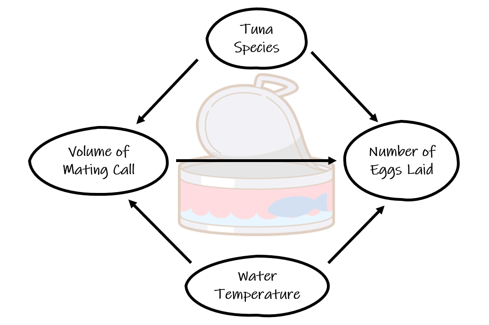

```{r setup, include=FALSE}
knitr::opts_chunk$set(echo = TRUE, warning = FALSE, message = FALSE)
knitr::opts_chunk$set(fig.pos = "!H", out.extra = "")
knitr::opts_chunk$set(out.width= "70%", out.height= "70%", fig.align = "center") 

```

### Update: `r Sys.Date()`

**Note:** This document ended up being longer than I expected but I think there is a lot of good stuff in here. It includes most of the hurdles I try to remember to caution cadets about each year. Hopefully it's not too boring to read and you find it worth it.

## Project Purpose:

We use models to help us understand the relationships between data (causal) as well as attempt to predict unknown information (predictive). In this project, we will focus on building a model to help us answer a research question by understanding the association between two or more variables. Although predictive models are as just as important, the fact is that you probably already have a bit of experience with these. In order to challenge and expose you to new things, this project focuses on causal models. 

You have the opportunity to choose nearly whatever project topic you'd like as long as it is feasible to support your analysis with representative data. I hope that you will choose something that is very interesting to you and your partner so you are more inclined to devote the proper effort to the project. Ordinarily you would formulate a research question, design an experiment or observational study, and then go out and collect data. While you have the option to complete a survey (more about that later), you are most likely going to utilize an existing data set. Because of this, you are somewhat limited in what variables you can include in your analysis. Optimally you would compose a research question, decide what variables you need in a data set, and then find the perfect data set with all of those variables. Practically, you are probably going to have to settle a little bit for using the best variables available to represent the variables needed to answer you research question. I urge you to spend the time finding the best data set you can, however, because it will make you analysis much better in the end.

## What makes a good research question?:
As mentioned, I want you to choose a topic that you and your partner are interested in. Furthermore, the research question you choose based on this topic should not be trivial. You should probably not ask "Is there an association between Cyber Officers and high intelligence?" Everyone knows that there is! I think you should focus on identifying a quantitative explanatory variable and a quantitative response variable and then compose a causal diagram that will help you identify confounding variables you also need to include in your analysis. 

Let's say I'm really interested in the mating habits of the albino tuna so I pose the question: Is there an association between the volume of their mating call (measured in decibels of course!) and the number of albino tuna eggs laid? This sounds very interesting and I'm sure to get an excellent grade! If I consider the association between these two variables I could also think of a few confounding variables to include in my analysis. Let's say there are two species of albino tuna. It makes sense that there might be an confounding relationship here. Perhaps I know, from my years studying the albino tuna, that water temperature also has an effect on the volume of the call. Throw it in the analysis!

{width=75%}

\newpage

## What makes a good data set?:
Now that I've decided on my research question and identified confounding variables, I need to find a data set. Fortunately, I'm a member of the ATCOA (Albino Tuna Club of America) so I know that there are several data sets out there with which I can conduct my analysis. You might not be so fortunate and your search can really go one of three ways:

1. You find what you need: fantastic!
2. You find something that will work: you might have to slightly change a variable or use a variable in the data set as a proxy for another variable. Let's say I'll have to use number of hatchlings instead of number of eggs laid. That will probably work... even if it's sub optimum.
3. You can't find anything that will work: you probably should look at finding a new question.

Be wary of and understand what the observational unit is in your data set. This is especially true when trying to "combine" data sets. If the observational unit for one data set is "state" and the other is "year", you may have trouble combining these data sets. Failure to understand the observation unit **will** cause you trouble when trying to conduct and explain your analysis.

You need to find a data set that has at least ten observations for each explanatory variable you have. If you have an categorical explanatory variable, you should have ten observations for each category in that variable.

**A brief note about categorical variables:**

You may recall that I've discussed how using a lot of categorical variables can cause your linear regression model to explode in length. Really this happens if you choose a categorical variable with a lot of categories. Choose the variables you need for your analysis... but do it knowing how it's going to affect your analysis. Perhaps there are small changes you can make to your choice of variable to reduce the number of categories: instead of state could you use region? You just went from 50 categories to maybe 5 or 6. 

Whenever you use some metric to reduce the number of categories, I encourage you to use some accepted metric for this. There is probably some list of the number of states that are included in each region. I find it much better to appeal to an external authority for these things. The same thing is true if you need to change a quantitative variable to a categorical, although you probably should not need to do that for this project.

## Why are you so down on surveys?:
I'm not "down" on surveys I just have a healthy aversion to cadets using them for this project based on past experience. This semester will be my fourth semester teaching an intro stats course and I have heard about, seen, and toiled on over 75 of these projects. Of the projects that included a survey, I've probably had one or two that was really well done and a lot of the fault was not with the cadets doing the project. There are two main issues you run into with survey projects:

1. Poor questions: If you aren't very careful in designing your questions, you may not actually be asking what you want to ask. Furthermore, if you don't constrain your survey answers, you're going to end up with messy answers that you have to spend time fixing. Switch to all multiple-choice questions you say? How are you going to collect the necessary quantitative data? Not impossible, just hard. Not to mention that the longer it takes your survey, the less likely people are to respond. This brings me to:
2. Representation: Who is going to answer you survey? You're probably going to send it out to your company, your friends, and maybe your team. Can you say this is a representative sample of your population? Of the people you send it to... how many are going to answer? 5? 10? Is that subset of your intended representative sample truly representative of the population or just representative of people who think like you? What happens when you don't get enough data points? Not impossible, just hard.

This is why I caution cadets about doing a survey for their project. You certainly overcome these hurdles but you have to be deliberate. The benefit of doing a survey is that you can explore some topics that are really relevant to you and your classmates.

## Project Proposal:
This should be a pretty low-threat submission but the timing may make it tricky as I need to have you turn it in before you shift focus to the midterm. As we enter into the block discussing linear regression, your project should be on your mind so you are prepared for this. Your submission needs to include:

1. A well-phrased research question.
2. A list of your variables, their categories, and their unit of measure in your dataset. 
3. A causal diagram using these variables.
4. A short description of your dataset (including where I can find it). Ensure you identify the observational unit.

You will submit this document as many times as necessary in order to get your project on a good track. Pick well early on!

## In-Progress Review (IPR) 1:
For this IPR, I'm interested in hearing about a few things:

1. Your research question: Hopefully that's pretty self-explanatory.
2. Background/Literature Review: I want you to find at least two **scholarly** articles concerning your topic. You will need to write a literature for your project paper but I just need bullet points for the IPR. Tell me what is already out there in the research about this topic (or closely related to it).
3. Your data set: Where did you get it from? How was it collected? Observational unit? Any "modifications" you're going to have to make to use it?
4. Data exploration: Show me some interesting things you found when exploring your data. You should be at the bi-variate analysis point here (maybe adding a color to show category). Plot your explanatory variables vs. the response and **analyze**. Pull out of a few interesting facts from the sample that may help inform further analysis. **No models at this point.**

You are going to use a Markdown Presentation for this briefing. Embrace a new thing! I don't need fancy but I do want professional. It's ok to have a little fun, but it should be clear you practiced.

Expect to give these to the class as a whole and your briefing should take between 5 to 7 minutes. If you'd like to pre-record, I'm ok with that just be ready to show the video in the class period set aside for IPR 1. This is a group event.

## In-Progress Review (IPR) 2:
This IPR should represent our last touch-point before you finalize your project. It should include a few things:

1. You research question: Just to remind your audience.
2. Your data set: Same idea, just a reminder.
3. Your linear model: You're project will include **one** linear model that contains all of the explanatory variables you have decided need to be in the model. The terms in your model are there because they are part of your research question, represent confounding variables, or are significant interaction terms. 
4. Your assessment of the validity conditions: This is important if you are going to make statistical inference from your sample data set.
5. Anything else you feel is important!

You aren't required to use Markdown for this presentation but feel free to if you'd like.

Expect to give these to the class as a whole and your briefing should take between 5 to 7 minutes. If you'd like to pre-record, I'm ok with that just be ready to show the video in the class period set aside for IPR 2. This is a group event.

## Project Presentation:
Your project presentation is one of two culminating events for your course project. You need to put together a professional presentation that demonstrates your mastery of your project material. While I leave the exact structure of the presentation up to you, you should take guidance from the content of IPRs 1 and 2 as to the minimum that should be included. 

You will have about 8 minutes for this presentation. Remember that background information is important but the main star of the project is the interpretation of your linear model. I want to know how/if your model helps you answer your research question. What went wrong? What went right?

You are free to use whatever presentation mechanism you'd like. While you can't pre-record this presentation, it needs to be apparent that you have rehearsed. This is a group event. One person in each group will turn this document in **.pptx** format on Microsoft Teams.

## Project Report:
The project report is the second of the two culminating events for your course project. It should include the same information that is in your presentation but you have a little more room for exposition here. Here are a couple points of guidance for your report:

1. It should be between 2 to 3 pages in length not including cover sheet, works cited, and the appendix.
2. As you limited in space, you will have to make wise decisions about the plots, figures, and tables (PFT) you include. These things should directly support a statement you are making in the paper if they are deemed worthy enough to take valuable space in the body of the report. If your PFT don't quite rise to that level of importance but you still want to reference them, include them in the appendix and reference them in the body. Your appendix is not the PFT dumpster.
3. I can't really think of a reason I should see any *R* code in your report.
4. In general you shouldn't be using bullet points. Your paper is about exposition not abbreviation. I realize it is ironic to say "no bullet points" in a bullet point.
5. I don't need you to include your whole data set in the report. Yes, I've seen it before.

I'm a big fan of students choosing how they will tell the story of their project's statistical journey. I don't like providing templates or structures because I want you to understand the process enough to effectively lay out your argument. However, I realize that this is likely the first class in statistics you have taken so I will give you an idea of how I would structure my report.

1. Background and Research Question: Introduce your project and provide the research question.
2. Literature Review: Describe scholarly work already done in this field. How did this research inform your analysis?
3. Data and Data Exploration: Introduce and summarize the data set you are using. Point out valuable insights gained from initial data exploration.
4. Methodology: The point of the project is to answer you research question. We have learned many statistical methods to answer research questions but you need to pick the best. Hint: The statistical method you should probably pick is multiple linear regression but why is this the correct one? What is it better than other methods?
5. Results: Present your model and interpret the terms. Discuss statistical inference of terms. Discuss validity conditions.
6. Discussion: Here is where you provide the "so what?" Discuss insights about your research question. Can you generalize your model? Why? Why not?
7. Conclusion and Future Work: Finalize the paper and discuss extensions of your research.

Please don't feel restricted by this. I've seen very successful projects that strayed from this format because the authors knew/cared enough to tell their project's story a little different and a little better.

You are required to use *R* Markdown for this report. You will turn your project in on Microsoft Teams in **.docx** format (remember you can knit to Word in *RStudio*). **This is an INDIVIDUAL event**.

## Closing Thoughts:
I sincerely hope this project doesn't turn into "one more project" for you. I know that is quite aspirational and I can understand that you are inundated with other priorities. I hope that you choose a topic that will make the experience a pleasant one for you. You really never know what you might find once you start looking. 