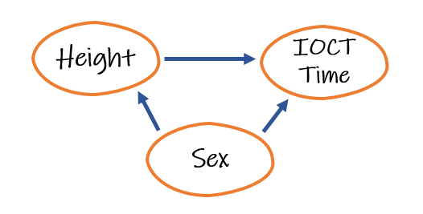

```{r setup, include=FALSE}
knitr::opts_chunk$set(echo = TRUE, warning = FALSE, message = FALSE)
knitr::opts_chunk$set(out.width= "70%", out.height= "70%", fig.align = "center")
```

### Identifying confounding variables:

For this example I am going to use the IOCT dataset available in the files tab on our course Teams. 

Every semester when I bring up this dataset, I get several cadets discuss how unfair the IOCT is for the height-impaired among us. I'm not a particularly tall person but I never had any issues with the IOCT so I feel it's best to let the data decide if these complaints have merits. Let's start with a research question: What is the association between heigh and IOCT Time?

I like to draw causal diagrams when I look start looking at research questions and I find these are particularly important when I think that linear regression is going to be my approach.


One of the purposes of this diagram is to identify any potential confounding variables that we need to include in our analysis. You will recall that confounding variables are those that are "related both to the explanatory and to the response variable in such a way that its effects on the response variable cannot be separated from the effects of the explanatory variable." This can be quite the definition so let's consider a concrete example here:


Is there a variable ("x") that we could put in the third bubble that you would say "x" has an effect on *height* and an effect on *IOCT Time*? Ordinarily, you would be compose this diagram at the same time as designing your experiment or observational study. This would allow you to indentify all the variables that it is important for you to collect data on. Obviously, as we are using a pre-assembled dataset, we won't be able to add any variables not available in the dataset so let's consider some of those. After looking at the dataset, I want to discuss two possibilites: *weight* and *sex*. 

First let's consider *weight*. I'm added *weight* to the causal diagram below a long with the arrows that I think best dictate the relationship between the variables.


You will notice the the arrow between *height* and *weight* has been reversed my the previous diagram. It seems to me that the "common sense" direction of this association is that *height* has an effect on *weight* and not the other way around. Could there be a relationship in the other direction? I suppose, but it seems much more likely that how tall you are provides the baseline for how much you are going to weigh. This means that *weight* is not likely a confounding variable and can be called a "mediator" (or one of the numerous other terms that are used depending on your statistical specialty).

Now let's consider *sex* as a confounding variable:



Is it logical to say that *sex* has an effect on *height*? Well as most of those complaining about being "too short for the IOCT" seem to be of the female persuasion, I would say that is likely. Can we also say that *sex* has an effect on *IOCT Time*? Well, it's nothing I've explored yet but that seems to make a lot more sense than *IOCT Time* having an effect on *sex*.

Now that we've identified a confounding variable we can now consider how to deal with it. Remember, because it is a confounding variable, we can say: the effects of *sex* on *IOCT Time* can not be seperated from the effects of *height*. This feel rather final... like there isn't anything we can do about it. Except there is! We can control for this confounding variable by including as a covariate in our regression model. I know that sounds complicated but it's really not.

Before we build the model, however, let's do some exploratory data analysis.

```{r}
library(tidyverse)

IOCT = read.csv("IOCT_tab_data.csv")

head(IOCT)

IOCT %>%
  ggplot(aes(x = height, y = IOCT_Time)) +
  geom_point() +
  labs(x = "Height (in)", y = "IOCT Time (s)",
       title = "IOCT Time vs. Height")
```
Considering this scatter plot, I would say there is a moderate negative linear relationship between *height* and *IOCT Time*. There are several unusual datapoints, however, the cadet with the *IOCT Time* of over 600 seconds is probably going to be influential in it's effect on the slope of our regression line.

```{r}
IOCT %>%
  ggplot(aes(x = sex, y = IOCT_Time)) +
  geom_boxplot() +
  labs(x = "Sex", y = "IOCT Time (s)",
       title = "IOCT Time vs. Sex")
```
This boxplot demonstrates that the median male time is sizably lower than the median female time. It also shows that that the variability of the male time is also a lot less. We can also identify that our influential point is a female cadet.

```{r}
IOCT %>%
  ggplot(aes(x = height, y = IOCT_Time, color = sex)) +
  geom_point() +
  labs(x = "Height (in)", y = "IOCT Time (s)",
       title = "IOCT Time vs. Height")
```
There isn't a lot of additional information gained from this plot but I wanted to demonstrate how you can include a color to differentiate categories by using a color. 

### The "outlier problem":

Another common thread of questions when we utilize this data set is what to do about the outlier. I'm sure the lady who recorded the over 10-minute time on the IOCT is a great person, but her data point is really cramping my modeling style. Can't we just remove it then? Well, in true statistics fashion, I'm going to answer this question with a set of other questions: Do you think there was a data collection error for this data point? Assuming not, what are you sacrificing by removing this cadet's time? If you start removing data points because you don't like them, where will the madness end?

I think these are all important questions to consider before you think about removing data points. As for me, unless there was a clear measurement error (like a weight of five pounds for a cadet), I like to leave them in until I've assessed their impact on my model.

### Multiple linear regression:

Now on to building our multiple linear regression model.
```{r}
model = lm(IOCT$IOCT_Time ~ IOCT$height + IOCT$sex)

summary(model)
```

Composing our linear model's equation from this output would give us:

$\hat{y} = -0.3966 x_{1} - 80.1894 x_{2} + 290.0195$

where $x_{1}$: height in inches and $x_{2}$: sex (0 is female, 1 is male)

To interpret our coefficients, we would say:

If sex is fixed, for every one inch increase in height, we expect a 0.3966 second decrease in IOCT time. Also, if height is fixed, males have a 80.1894 second faster IOCT time on average.

### Indicator encoding

How did I know that "0" was *female* and "1" was *male* for our model? Well, as you know from your reading, there are two different types of encoding for categorical variables in the regression: indicator and effects. *R* uses indicator encoding meaning that it chooses an indicator variable(s) (**IOCT$sexM** in this case) to represent your categories. You'll probably hear me call this "one-hot encoding" because I'm most familiar with it in machine learning contexts. It's probably not strictly "one-hot encoding" but it's close. Here is an example:

Let's say you variable is *color* and it has four value: red, white, blue, green. To represent these four categories using indicator variables in our model we would use three indicator variables: **colorR**, **colorW**, **colorB**. How can three variables represent four categories? Check out the table below:

|       | colorR | colorW | colorB |
|-------|--------|--------|--------|
| Red   | 1      | 0      | 0      |
| White | 0      | 1      | 0      |
| Blue  | 0      | 0      | 1      |
| Green | 0      | 0      | 0      |

As you can see, at most one indicator variable is "hot" (value of 1) at at a time. We can represent our fourth category by turning them all "cold." You can also see that "red" is represented by **colorR** being hot... this how I knew that "male" was 1 for the indicator variable in our regression model.

This indicator encoding is why I also caution you to try to stick with quantitative variables for your project. You can see how adding a few categorical variabls with a few categories each can add a lot of terms to your model very quickly. Add the categorical variables that you need to for your research question... just be smart about it.
       
### Statistical inference

Now that we have built a multiple regression model we have slope estimates that depict the association between the variables in our sample. What can we say about the true relationship between these variables? I always prefer to use the theory-based approach (especially considering the model summary provides us the p-values) but we need to check the validity conditions first.

**L**inearity and **E**qual Variance:
```{r}
model %>%
  ggplot(aes(x = .fitted, y = .resid)) +
  geom_point() +
  labs(x = "Predicted", y = "Residuals",
       title = "Residuals vs. Predicted") +
  geom_hline(yintercept = 0)
```
Full stop! If you see this sort of output on one of your diagnostic plots, you have an issue and should investigate it further. How? We'll talk more about this next class but, for now, let's finish with out validity conditions.

**I**ndepdence:

I believe it is reasonable to assume that the height, sex, and IOCT time of one cadet is independent of another cadet.

**N**ormally-distributed residuals:
```{r}
model %>%
  ggplot(aes(x = .resid)) +
  geom_histogram() +
  labs(x = "Residuals", y = "Count",
       title = "Distribution of Residuals")
```
For this validity condition we are assessing the normality of the distribution of our residuals. Because I perceive that we may have some issues here, I'm going to borrow some code from my *Normality Testing* document:
```{r}
RSE = summary(model)[[6]][[1]]

sd_count = as.data.frame(model$residuals) %>%
  mutate(sd_away = ceiling(abs(model$residuals / RSE))) %>%
  group_by(sd_away) %>%
  summarise(count = n())

paste("Within 1SD:", sd_count[1,2] / nrow(IOCT))
paste("Within 2SD:", (sd_count[1,2] + sd_count[2,2]) / nrow(IOCT))
paste("Within 3SD:", (sd_count[1,2] + sd_count[2,2] + sd_count[3,2]) / nrow(IOCT))
```
While we see a higher distribution of points within one standard deviation than we'd expect, these value match our "68-95-99 Rule" fairly well. Much better than I expected by looking at the histogram by itself. Here is a perfect example that, just because you have outliers, doesn't mean your residuals are normally distributed.

In totality, except for the first diagnotic plot, our validity conditions look pretty good. I have a good idea what is going on with the first plot but I'm not going to tell you until next lesson on interaction terms. For the purposes of discussing the p-values, let's **assume** that our validity conditions are met.

Before we can interpret the p-values, we need to have our hypothesis.

**Height**

$H_{0}:$ Controlling for sex, there is no association between height and IOCT time ($\beta_{1} = 0$)

$H_{a}:$ Controlling for sex, there is an association between height and IOCT time ($\beta_{1} \neq 0$)

Our model summary states that the p-value for our height slope parameter estimate ($\beta_{1}$) is 0.612 which means we have little to no evidence against the null hypothesis. This suggests we can not make the inference that there is an association between height and IOCT time from this sample.

**Sex**

$H_{0}:$ Controlling for height, there is no association between sex and IOCT time ($\beta_{2} = 0$)

$H_{a}:$ Controlling for height, there is an association between sex and IOCT time ($\beta_{2} \neq 0$)

Our model summary states that the p-value for our sex slope parameter estimate ($\beta_{2}$) is **less than** $2 \times 10^{-16}$ (also known as "basically 0"). This suggests this sample provides very strong evidence against the null hypothesis and, further, suggests there is an association between sex and IOCT time.

